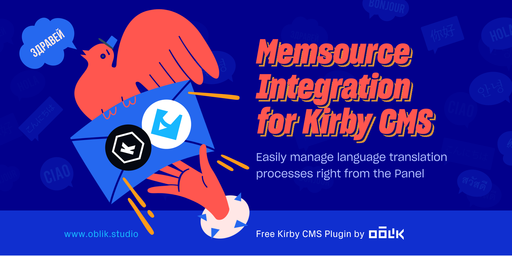
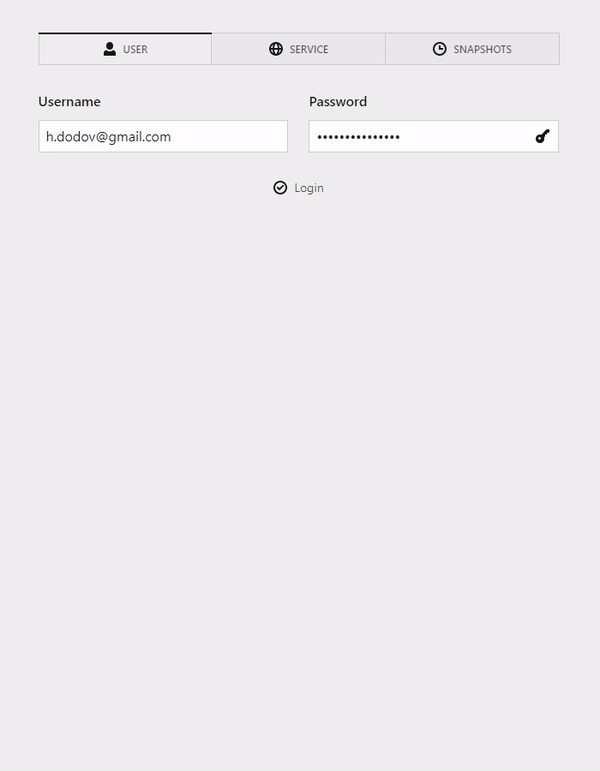
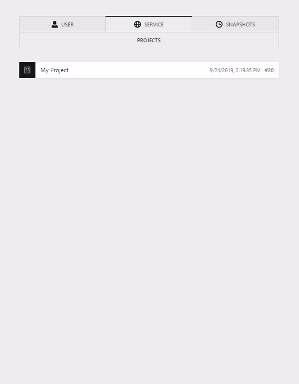

This plugin allows you to translate your entire site content in the powerful TMS [Memsource](https://www.memsource.com/):

-   Create Memsource jobs with great control over what's exported
-   Import Memsource jobs with reports for what has changed
-   Great control over the exported format of fields via [kirby-walker](https://github.com/OblikStudio/kirby-walker)
-   Support for the [Kirby Editor](https://github.com/getkirby/editor)

| Exporting Content          | Importing Translations     |
| -------------------------- | -------------------------- |
|  |  |

**Note:** Currently does not support Kirby `3.6` and above.

## Installation

With Composer from [oblik/kirby-memsource](https://packagist.org/packages/oblik/kirby-memsource) on Packagist:

```
composer require oblik/kirby-memsource
```

[Sign up](https://cloud.memsource.com/web/organization/signup?e=DEVELOPER) for a developer account in Memsource.

## Context notes

You can specify comments to aid translators by adding them in the blueprint:

```yml
fields:
    heading:
        type: text
        memsource:
            note: This is the title of the page.
```

When exported, the JSON will look like this:

```json
{
    "pages": {
        "home": {
            "heading": {
                "$value": "Hello World!",
                "$note": "This is the title of the page."
            }
        }
    }
}
```

Then, you can configure Memsource's [context note functionality](https://support.phrase.com/hc/en-us/articles/5709700187292) to trigger on `$note` keys.

## Settings

You can configure the plugin in your `site/config.php`:

```php
return [
    'oblik.memsource' => [
        // settings…
    ]
];
```

### Credentials

Add your Memsource account credentials:

```php
return [
    'oblik.memsource' => [
        'login' => [
            'username' => 'john',
            'password' => '1234'
        ]
    ]
];
```

### Remove `<br>` tags

You might want to put `<br>` to force text to break at specific positions in order to achieve a certain layout effect. This is pretty much impossible to be achieved in translations because the text will have different word length and overall length.

For this reason, you might want to remove `<br>` tags from your exports:

```php
return [
    'oblik.memsource' => [
        'walker' => [
            'removeBrTags' => true
        ]
    ]
];
```

### Dynamic context notes

You may generate context notes on the fly:

```php
return [
    'oblik.memsource' => [
        'walker' => [
            'contextNote' => function ($value) {
                if (strpos($value, '{{ year }}') !== false) {
                    return "{{ year }} is the current calendar year.";
                }
            }
        ]
    ]
];
```
